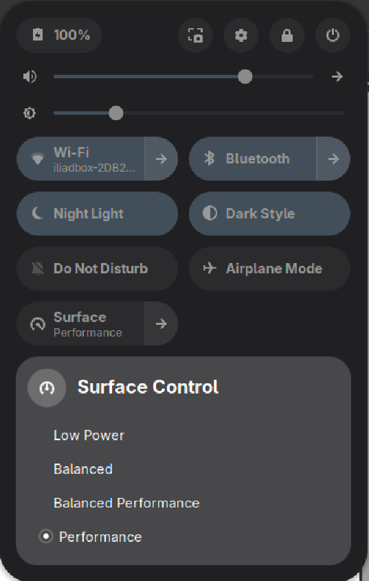

# Surface Control

**GNOME Shell extension for Microsoft Surface hardware.**

Control your Surface device directly from the Quick Settings panel — switch power profiles, check discrete GPU state, and manage Surface Book detachment without opening a terminal.



---

## Features

### Platform Profiles
Switch between all four power modes from the Quick Settings menu:

| Profile | Description |
|---------|-------------|
| Low Power | Maximum battery savings for reading, writing, light tasks |
| Balanced | Default everyday use — good balance of performance and battery |
| Balanced Performance | Extra headroom for demanding apps without full performance draw |
| Performance | Maximum CPU/GPU throughput, plugged-in use |

The tile shows the active profile. Clicking it toggles between Balanced and your last non-default profile. The chevron opens the full menu for direct selection. Changes made externally are reflected instantly via a kernel sysfs monitor — no polling.

### Panel Indicator
A contextual icon appears in the top bar whenever you're on a non-Balanced profile — a quick visual reminder without permanent clutter.

### Discrete GPU Status *(Surface Book with dGPU)*
Shows current dGPU power state and runtime PM mode in the menu. Hidden automatically on devices without a discrete GPU.

### Surface Book Detachment *(Surface Book 2)*
Request or cancel clipboard detachment directly from the Quick Settings panel. Hidden automatically on devices without DTX hardware.

---

## Requirements

- GNOME Shell **45 or later**
- Linux Surface kernel ([linux-surface](https://github.com/linux-surface/linux-surface))

---

## Installation

### 1. Grant write access to the platform profile

The kernel exposes the power profile at `/sys/firmware/acpi/platform_profile`, but only root can write it by default. Run the included setup script once to fix this permanently:

```sh
bash setup-permissions.sh
```

This creates `/etc/tmpfiles.d/surface-control.conf` which runs at every boot via `systemd-tmpfiles`, granting your user group write access before the session starts. No reboot needed — it applies immediately.

If the extension loads without this step, the tile will show **"Setup required"** and profile switching will be disabled until you run the script.

### 2. Install the extension

```sh
git clone https://github.com/scaccogatto/gse-surface.git
cp -r gse-surface/surface-control@scaccogatto.github.com \
      ~/.local/share/gnome-shell/extensions/
```

Log out and back in, then enable:

```sh
gnome-extensions enable surface-control@scaccogatto.github.com
```

---

## How It Works

- **Profile reads** — watches `/sys/firmware/acpi/platform_profile` via `Gio.FileMonitor` for instant, zero-overhead change detection
- **Profile writes** — writes directly to sysfs via `Gio.File`; no subprocess, no PATH dependency
- **Permission check** — probes write access at startup; shows an in-tile error with instructions if access is missing
- **Hardware detection** — probes `surface dgpu` and `surface dtx` at startup; sections unavailable on your device are simply not shown
- **Clean teardown** — all monitors cancelled, all GObject references nulled on `disable()`

---

## Development

```sh
# Clone
git clone https://github.com/scaccogatto/gse-surface.git
cd gse-surface

# Symlink for live editing
ln -sf "$PWD/surface-control@scaccogatto.github.com" \
        ~/.local/share/gnome-shell/extensions/

# Reload extension without logout (disable + enable via DBus)
gdbus call --session --dest org.gnome.Shell --object-path /org/gnome/Shell \
  --method org.gnome.Shell.Extensions.DisableExtension \
  "surface-control@scaccogatto.github.com"
gdbus call --session --dest org.gnome.Shell --object-path /org/gnome/Shell \
  --method org.gnome.Shell.Extensions.EnableExtension \
  "surface-control@scaccogatto.github.com"

# Watch logs
journalctl -f -o cat /usr/bin/gnome-shell | grep -i surface
```

### File Structure

```
surface-control@scaccogatto.github.com/
├── metadata.json       # Extension identity and supported shell versions
├── extension.js        # Entry point — enable() / disable() lifecycle
├── indicator.js        # SystemIndicator + QuickMenuToggle UI
├── profileManager.js   # sysfs file monitor, permission check, profile read/write
├── dgpuManager.js      # dGPU detection and state
├── dtxManager.js       # DTX detection and detachment controls
└── utils.js            # Profile definitions, icons, subprocess helpers
setup-permissions.sh    # One-time setup: grants write access to sysfs profile file
```

---

## Compatibility

| GNOME Shell | Status |
|-------------|--------|
| 50 | Tested |
| 45 – 49 | Should work (ESModules + Quick Settings API stable since 45) |
| < 45 | Not supported |

---

## License

GPL-2.0-or-later — required for GNOME Shell extensions (GNOME Shell is GPL-2.0-or-later).
